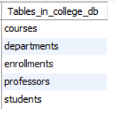
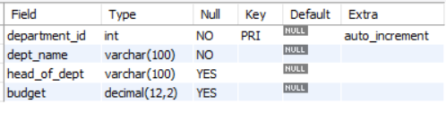
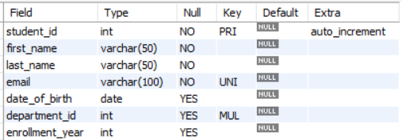
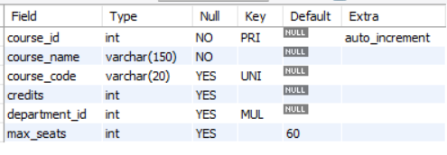
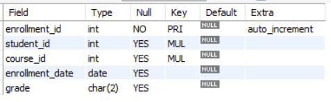
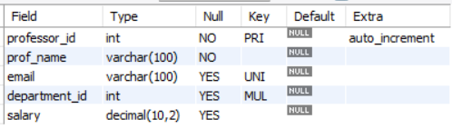
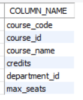
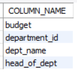

# Hands-On 1 – Schema Design & Core SQL (DDL and Normalisation)

## Objective

Design the `college_db` database, create all required tables with appropriate constraints, verify database normalization (1NF, 2NF, and 3NF), and perform schema modifications using SQL DDL statements.

---

# Task 1 – Create the Database and Tables

## Step 1 – Create a New Database Named `college_db`

```sql
CREATE DATABASE college_db;

USE college_db;
```

---

## Step 2 – Write CREATE TABLE Statements for All Five Tables

### Departments Table

```sql
CREATE TABLE departments (
    department_id INT AUTO_INCREMENT PRIMARY KEY,
    dept_name VARCHAR(100) NOT NULL,
    hod_name VARCHAR(100),
    budget DECIMAL(12,2)
);
```

### Students Table

```sql
CREATE TABLE students (
    student_id INT AUTO_INCREMENT PRIMARY KEY,
    first_name VARCHAR(50) NOT NULL,
    last_name VARCHAR(50) NOT NULL,
    email VARCHAR(100) NOT NULL UNIQUE,
    date_of_birth DATE,
    department_id INT,
    enrollment_year INT,
    FOREIGN KEY (department_id)
    REFERENCES departments(department_id)
);
```

### Courses Table

```sql
CREATE TABLE courses (
    course_id INT AUTO_INCREMENT PRIMARY KEY,
    course_name VARCHAR(150) NOT NULL,
    course_code VARCHAR(20) UNIQUE,
    credits INT,
    department_id INT,
    FOREIGN KEY (department_id)
    REFERENCES departments(department_id)
);
```

### Enrollments Table

```sql
CREATE TABLE enrollments (
    enrollment_id INT AUTO_INCREMENT PRIMARY KEY,
    student_id INT,
    course_id INT,
    enrollment_date DATE,
    grade CHAR(2),
    FOREIGN KEY (student_id)
    REFERENCES students(student_id),
    FOREIGN KEY (course_id)
    REFERENCES courses(course_id)
);
```

### Professors Table

```sql
CREATE TABLE professors (
    professor_id INT AUTO_INCREMENT PRIMARY KEY,
    prof_name VARCHAR(100) NOT NULL,
    email VARCHAR(100) UNIQUE,
    department_id INT,
    salary DECIMAL(10,2),
    FOREIGN KEY (department_id)
    REFERENCES departments(department_id)
);
```

---

## Step 3 – Add NOT NULL, UNIQUE and PRIMARY KEY Constraints

The following constraints are applied during table creation.

- `PRIMARY KEY`
- `NOT NULL`
- `UNIQUE`

Example:

```sql
department_id INT AUTO_INCREMENT PRIMARY KEY,
dept_name VARCHAR(100) NOT NULL,
email VARCHAR(100) UNIQUE
```

---

## Step 4 – Define FOREIGN KEY Constraints

Foreign key relationships are created while defining the tables.

```sql
FOREIGN KEY (department_id)
REFERENCES departments(department_id);

FOREIGN KEY (student_id)
REFERENCES students(student_id);

FOREIGN KEY (course_id)
REFERENCES courses(course_id);
```

---

## Step 5 – Execute the CREATE TABLE Statements and Verify

```sql
SHOW TABLES;

DESCRIBE departments;
DESCRIBE students;
DESCRIBE courses;
DESCRIBE enrollments;
DESCRIBE professors;
```

### Output

#### Verify Tables



#### Describe Departments



#### Describe Students



#### Describe Courses



#### Describe Enrollments



#### Describe Professors



---

# Task 2 – Verify Normalisation

## Step 6 – Verify First Normal Form (1NF)

```sql
-- First Normal Form (1NF)

-- All attributes contain atomic values.
-- No repeating groups exist.
-- Each row is uniquely identifiable.
-- Example violation:
-- Storing multiple phone numbers in one column.
```

---

## Step 7 – Verify Second Normal Form (2NF)

```sql
-- Second Normal Form (2NF)

-- Every non-key attribute depends
-- on the complete primary key.

-- In the enrollments table,
-- enrollment_date and grade depend
-- on the complete enrollment record.
```

---

## Step 8 – Verify Third Normal Form (3NF)

```sql
-- Third Normal Form (3NF)

-- No transitive dependencies exist.

-- Department details are stored
-- only in the departments table.

-- Students, Courses and Professors
-- reference departments using
-- department_id.
```

---

## Step 9 – Document 3NF Analysis

```sql
-- 3NF Analysis for Enrollments Table

-- Grade depends only on the enrollment.
-- Enrollment_date depends only on the enrollment.
-- Student information is stored
-- in the students table.
-- Course information is stored
-- in the courses table.

-- Therefore,
-- the enrollments table satisfies
-- Third Normal Form (3NF).
```
---

# Task 3 – Alter and Extend the Schema

## Step 10 – Add a `phone_number` Column to the `students` Table

```sql
ALTER TABLE students
ADD phone_number VARCHAR(15);
```

---

## Step 11 – Add a `max_seats` Column to the `courses` Table

```sql
ALTER TABLE courses
ADD max_seats INT DEFAULT 60;
```

---

## Step 12 – Add a CHECK Constraint to the `grade` Column

```sql
ALTER TABLE enrollments
ADD CONSTRAINT chk_grade
CHECK (grade IN ('A','B','C','D','F') OR grade IS NULL);
```

---

## Step 13 – Rename the `hod_name` Column to `head_of_dept`

```sql
ALTER TABLE departments
RENAME COLUMN hod_name TO head_of_dept;
```

---

## Step 14 – Remove the `phone_number` Column from the `students` Table

```sql
ALTER TABLE students
DROP COLUMN phone_number;
```

---

## Step 15 – Verify the Schema Changes Using `INFORMATION_SCHEMA`

```sql
SELECT COLUMN_NAME
FROM INFORMATION_SCHEMA.COLUMNS
WHERE TABLE_SCHEMA = 'college_db'
AND TABLE_NAME = 'departments';

SELECT COLUMN_NAME
FROM INFORMATION_SCHEMA.COLUMNS
WHERE TABLE_SCHEMA = 'college_db'
AND TABLE_NAME = 'courses';
```

### Output

#### Verify Departments Schema



#### Verify Courses Schema



---

# Learning Outcomes

After completing this hands-on, I was able to:

- Create a relational database using SQL.
- Design tables with appropriate data types.
- Apply PRIMARY KEY, FOREIGN KEY, NOT NULL, UNIQUE, and CHECK constraints.
- Understand and verify database normalization (1NF, 2NF, and 3NF).
- Modify existing database schemas using `ALTER TABLE`.
- Rename and remove table columns.
- Verify schema changes using `INFORMATION_SCHEMA`.
- Gain practical experience in relational database design and SQL Data Definition Language (DDL).

---

# Author

**Name:** Ezhil Sree J

**Program:** Cognizant Digital Nurture 5.0 – Python Full Stack Engineer (FSE)