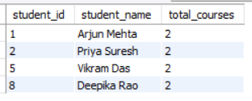
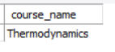
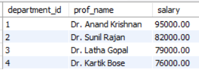
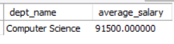
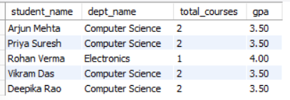
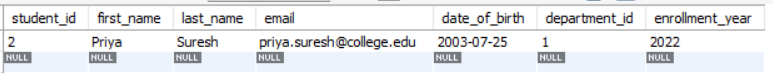
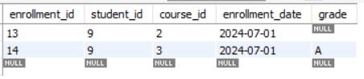

# Hands-On 3 – Advanced SQL (Subqueries, Views & Transactions)

## Objective

Perform advanced SQL operations using subqueries, views, stored procedures, and transactions to retrieve, manage, and maintain data integrity in the `college_db` database.

---

# Task 1 – Subqueries

## Step 35 – Find Students Enrolled in More Courses Than the Average

```sql
SELECT
    s.student_id,
    CONCAT(s.first_name,' ',s.last_name) AS student_name,
    COUNT(e.course_id) AS total_courses
FROM students s
JOIN enrollments e
ON s.student_id = e.student_id
GROUP BY s.student_id, student_name
HAVING COUNT(e.course_id) >
(
    SELECT AVG(course_count)
    FROM
    (
        SELECT COUNT(course_id) AS course_count
        FROM enrollments
        GROUP BY student_id
    ) avg_table
);
```

### Output



---

## Step 36 – Find Courses Where Every Student Received Grade 'A'

```sql
SELECT c.course_name
FROM courses c
WHERE NOT EXISTS
(
    SELECT *
    FROM enrollments e
    WHERE e.course_id = c.course_id
    AND e.grade <> 'A'
);
```

### Output



---

## Step 37 – Find the Highest Paid Professor in Each Department

```sql
SELECT
    p.department_id,
    p.prof_name,
    p.salary
FROM professors p
WHERE salary =
(
    SELECT MAX(p2.salary)
    FROM professors p2
    WHERE p2.department_id = p.department_id
);
```

### Output



---

## Step 38 – Find Departments with Average Professor Salary Above 85000

```sql
SELECT
    dept_name,
    average_salary
FROM
(
    SELECT
        d.dept_name,
        AVG(p.salary) AS average_salary
    FROM departments d
    JOIN professors p
    ON d.department_id = p.department_id
    GROUP BY d.department_id, d.dept_name
) salary_table
WHERE average_salary > 85000;
```

### Output



---

# Task 2 – Creating and Using Views

## Step 39 – Create Student Enrollment Summary View

```sql
CREATE VIEW vw_student_enrollment_summary AS
SELECT
    CONCAT(s.first_name,' ',s.last_name) AS student_name,
    d.dept_name,
    COUNT(e.course_id) AS total_courses,
    ROUND(
        AVG(
            CASE
                WHEN e.grade='A' THEN 4
                WHEN e.grade='B' THEN 3
                WHEN e.grade='C' THEN 2
                WHEN e.grade='D' THEN 1
                ELSE 0
            END
        ),2
    ) AS gpa
FROM students s
LEFT JOIN departments d
ON s.department_id=d.department_id
LEFT JOIN enrollments e
ON s.student_id=e.student_id
GROUP BY s.student_id, student_name, d.dept_name;
```

---

## Step 40 – Create Course Statistics View

```sql
CREATE VIEW vw_course_stats AS
SELECT
    c.course_name,
    c.course_code,
    COUNT(e.student_id) AS total_enrollments,
    ROUND(
        AVG(
            CASE
                WHEN e.grade='A' THEN 4
                WHEN e.grade='B' THEN 3
                WHEN e.grade='C' THEN 2
                WHEN e.grade='D' THEN 1
                ELSE 0
            END
        ),2
    ) AS average_gpa
FROM courses c
LEFT JOIN enrollments e
ON c.course_id=e.course_id
GROUP BY c.course_id, c.course_name, c.course_code;
```

---

## Step 41 – Retrieve Students with GPA Greater Than 3.0

```sql
SELECT *
FROM vw_student_enrollment_summary
WHERE gpa > 3.0;
```

### Output



---

## Step 42 – Attempt to Update the View

```sql
UPDATE vw_student_enrollment_summary
SET dept_name='Computer Science'
WHERE student_name='Arjun Mehta';
```

> **Note:** This operation results in an error because the view is created using joins and aggregate functions, making it non-updatable in MySQL.

---

## Step 43 – Drop and Recreate the View Using CHECK OPTION

```sql
DROP VIEW IF EXISTS vw_student_enrollment_summary;

CREATE VIEW vw_student_enrollment_summary AS
SELECT
    student_id,
    first_name,
    last_name,
    department_id
FROM students
WHERE department_id = 1
WITH CHECK OPTION;
```
---

# Task 3 – Stored Procedures and Transactions

## Step 44 – Create a Stored Procedure to Enroll a Student

```sql
DELIMITER $$

CREATE PROCEDURE sp_enroll_student
(
    IN p_student_id INT,
    IN p_course_id INT,
    IN p_enrollment_date DATE
)
BEGIN

    IF EXISTS
    (
        SELECT 1
        FROM enrollments
        WHERE student_id = p_student_id
        AND course_id = p_course_id
    )
    THEN
        SIGNAL SQLSTATE '45000'
        SET MESSAGE_TEXT = 'Student is already enrolled in this course.';
    ELSE
        INSERT INTO enrollments
        (
            student_id,
            course_id,
            enrollment_date,
            grade
        )
        VALUES
        (
            p_student_id,
            p_course_id,
            p_enrollment_date,
            NULL
        );
    END IF;

END $$

DELIMITER ;

CALL sp_enroll_student(9,2,'2024-07-01');
```

### Output


---

## Step 45 – Create a Procedure to Transfer a Student Between Departments

```sql
CREATE TABLE IF NOT EXISTS department_transfer_log
(
    log_id INT AUTO_INCREMENT PRIMARY KEY,
    student_id INT,
    old_department INT,
    new_department INT,
    transfer_date TIMESTAMP DEFAULT CURRENT_TIMESTAMP
);

DELIMITER $$

CREATE PROCEDURE sp_transfer_student
(
    IN p_student INT,
    IN p_new_department INT
)
BEGIN

    DECLARE old_dept INT;

    START TRANSACTION;

    SELECT department_id
    INTO old_dept
    FROM students
    WHERE student_id = p_student;

    UPDATE students
    SET department_id = p_new_department
    WHERE student_id = p_student;

    INSERT INTO department_transfer_log
    (
        student_id,
        old_department,
        new_department
    )
    VALUES
    (
        p_student,
        old_dept,
        p_new_department
    );

    COMMIT;

END $$

DELIMITER ;

CALL sp_transfer_student(1,2);
```

### Output


---

## Step 46 – Demonstrate Transaction Rollback

```sql
START TRANSACTION;

UPDATE students
SET department_id = 3
WHERE student_id = 2;

UPDATE students
SET department_id = 999
WHERE student_id = 2;

ROLLBACK;

SELECT *
FROM students
WHERE student_id = 2;
```

### Output


---

## Step 47 – Demonstrate SAVEPOINT

```sql
START TRANSACTION;

INSERT INTO enrollments
(
    student_id,
    course_id,
    enrollment_date,
    grade
)
VALUES
(
    9,
    3,
    '2024-07-01',
    'A'
);

SAVEPOINT first_insert;

INSERT INTO enrollments
(
    student_id,
    course_id,
    enrollment_date,
    grade
)
VALUES
(
    9,
    999,
    '2024-07-01',
    'A'
);

ROLLBACK TO first_insert;

COMMIT;

SELECT *
FROM enrollments
WHERE student_id = 9;
```

### Output


---

# Learning Outcomes

After completing this hands-on, I was able to:

- Write correlated and non-correlated subqueries.
- Create and query SQL views.
- Understand the behavior and limitations of SQL views.
- Develop stored procedures using MySQL.
- Implement transaction management using `COMMIT`, `ROLLBACK`, and `SAVEPOINT`.
- Maintain data consistency through transaction control.

---

# Author

**Name:** Ezhil Sree J

**Program:** Cognizant Digital Nurture 5.0 – Python Full Stack Engineer (FSE)