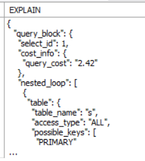
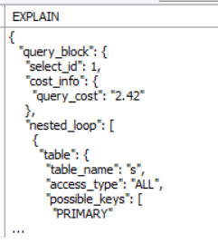
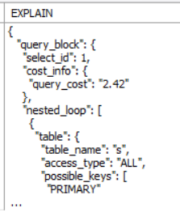
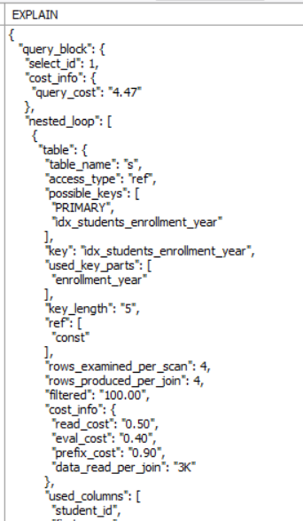
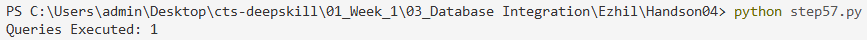

# Hands-On 4 – Query Optimisation (Indexes, EXPLAIN & the N+1 Problem)

## Objective

Analyze query performance using `EXPLAIN`, optimize queries by creating indexes, compare execution plans, and understand the N+1 Query Problem.

---

# Task 1 – Baseline Performance (No Indexes)

## Step 48 – Analyze Query Using EXPLAIN FORMAT=JSON

```sql
EXPLAIN FORMAT=JSON

SELECT
    s.first_name,
    s.last_name,
    c.course_name
FROM enrollments e
JOIN students s
ON s.student_id = e.student_id
JOIN courses c
ON c.course_id = e.course_id
WHERE s.enrollment_year = 2022;
```

### Output



---

## Step 49 – Identify Query Plan

```sql
EXPLAIN FORMAT=JSON

SELECT
    s.first_name,
    s.last_name,
    c.course_name
FROM enrollments e
JOIN students s
ON s.student_id = e.student_id
JOIN courses c
ON c.course_id = e.course_id
WHERE s.enrollment_year = 2022;
```

### Observation

The execution plan shows full table scans because no indexes have been created yet.

### Output



---

## Step 50 – Estimate Rows Examined

```sql
EXPLAIN FORMAT=JSON

SELECT
    s.first_name,
    s.last_name,
    c.course_name
FROM enrollments e
JOIN students s
ON s.student_id = e.student_id
JOIN courses c
ON c.course_id = e.course_id
WHERE s.enrollment_year = 2022;
```

### Observation

The execution plan estimates the number of rows examined for each table.

### Output



---

# Task 2 – Add Indexes and Compare Plans

## Step 51 – Create B-Tree Index on Enrollment Year

```sql
CREATE INDEX idx_students_enrollment_year
ON students(enrollment_year);
```

---

## Step 52 – Create Composite UNIQUE Index

```sql
CREATE UNIQUE INDEX idx_enrollments_student_course
ON enrollments(student_id, course_id);
```

---

## Step 53 – Create Index on Course Code

```sql
CREATE INDEX idx_courses_course_code
ON courses(course_code);
```

---

## Step 54 – Compare Execution Plan After Indexing

```sql
EXPLAIN FORMAT=JSON

SELECT
    s.first_name,
    s.last_name,
    c.course_name
FROM enrollments e
JOIN students s
ON s.student_id = e.student_id
JOIN courses c
ON c.course_id = e.course_id
WHERE s.enrollment_year = 2022;
```

### Observation

The execution plan should now use indexes instead of full table scans wherever applicable.

### Output



---

## Step 55 – Optimize NULL Grade Lookup

> **Note:** This statement follows the handbook exactly. Partial indexes are supported in PostgreSQL but are not supported in MySQL. Executing this statement in MySQL Workbench will result in a syntax error.

```sql
CREATE INDEX idx_enrollments_null_grade
ON enrollments(student_id)
WHERE grade IS NULL;
```

---

# Task 3 – Identify and Fix the N+1 Problem

## Step 56 – Simulate the N+1 Problem

**Python Code**

```python
import mysql.connector

conn = mysql.connector.connect(
    host="localhost",
    user="root",
    password="your_password",
    database="college_db"
)

cursor = conn.cursor(dictionary=True)

cursor.execute("SELECT * FROM enrollments")
enrollments = cursor.fetchall()

query_count = 1

for enrollment in enrollments:
    cursor.execute(
        "SELECT first_name, last_name FROM students WHERE student_id=%s",
        (enrollment["student_id"],)
    )
    cursor.fetchone()
    query_count += 1

print("Queries Executed:", query_count)

cursor.close()
conn.close()
```

### Output


---

## Step 57 – Solve the N+1 Problem Using a JOIN

**Python Code**

```python
import mysql.connector

conn = mysql.connector.connect(
    host="localhost",
    user="root",
    password="your_password",
    database="college_db"
)

cursor = conn.cursor(dictionary=True)

cursor.execute("""
SELECT
    e.enrollment_id,
    s.first_name,
    s.last_name,
    c.course_name,
    e.grade
FROM enrollments e
JOIN students s
ON e.student_id = s.student_id
JOIN courses c
ON e.course_id = c.course_id
""")

records = cursor.fetchall()

print("Queries Executed: 1")

cursor.close()
conn.close()
```

### Output


---

## Step 58 – Compare Database Round-Trips

### Observation

| Approach | Queries Executed |
|----------|-----------------:|
| N+1 Query | 1 + N Queries |
| Optimized JOIN | 1 Query |

The JOIN approach minimizes database round-trips and significantly improves performance.

---

## Step 59 – Explain the N+1 Problem

### Explanation

The N+1 Query Problem occurs when:

- One query retrieves **N** records.
- An additional query is executed for each record.
- Total database queries become **N + 1**.

For example:

- 10 enrollments → 11 queries
- 100 enrollments → 101 queries
- 10,000 enrollments → 10,001 queries

Using a single `JOIN` query retrieves all required data in one database call, eliminating unnecessary database round-trips and improving application performance.

---

# Learning Outcomes

After completing this hands-on, I was able to:

- Analyze SQL query execution plans using `EXPLAIN FORMAT=JSON`.
- Identify full table scans and estimate rows examined.
- Improve query performance using B-Tree and composite indexes.
- Understand the impact of indexes on query execution plans.
- Learn the MySQL alternative to partial indexes.
- Identify and resolve the N+1 Query Problem.
- Compare database round-trips before and after optimization.
- Optimize database access using SQL JOIN operations.

---

# Author

**Name:** Ezhil Sree J

**Program:** Cognizant Digital Nurture 5.0 – Python Full Stack Engineer (FSE)