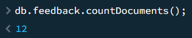
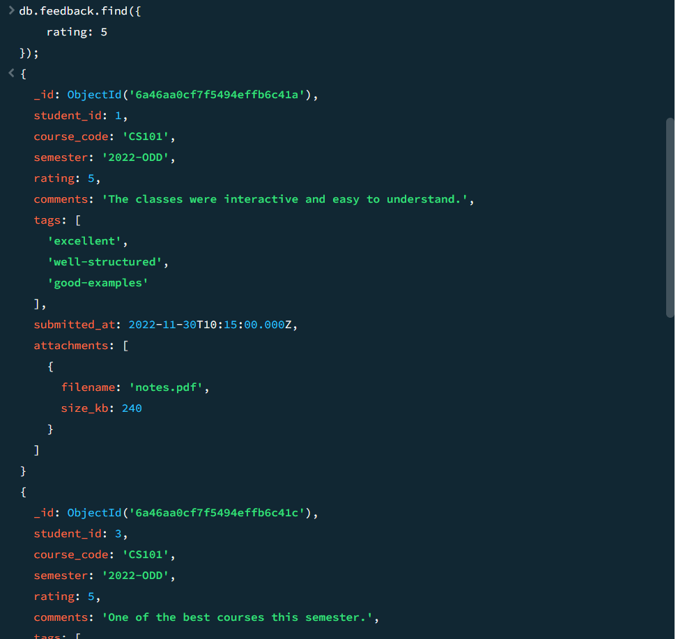
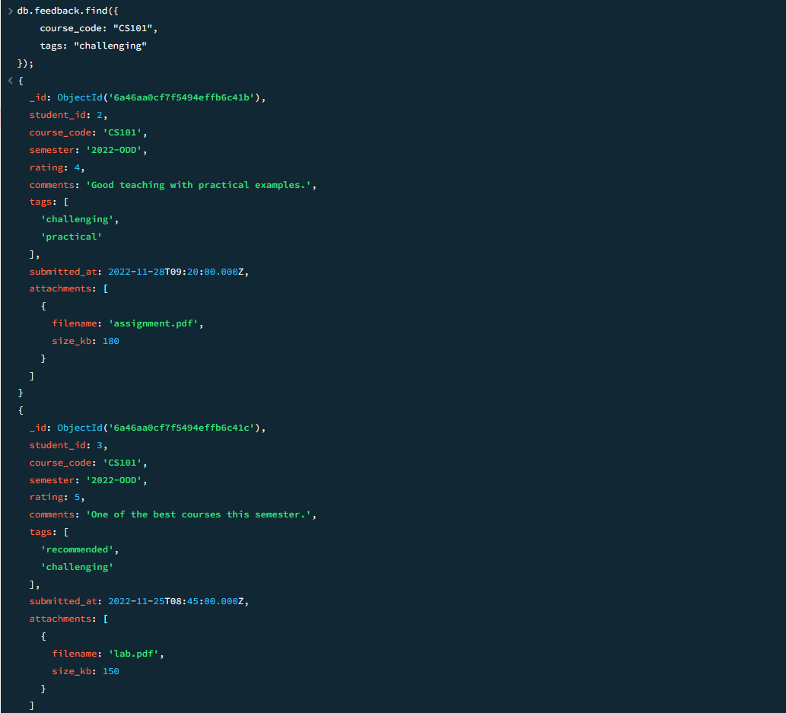
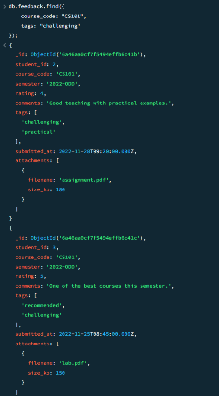
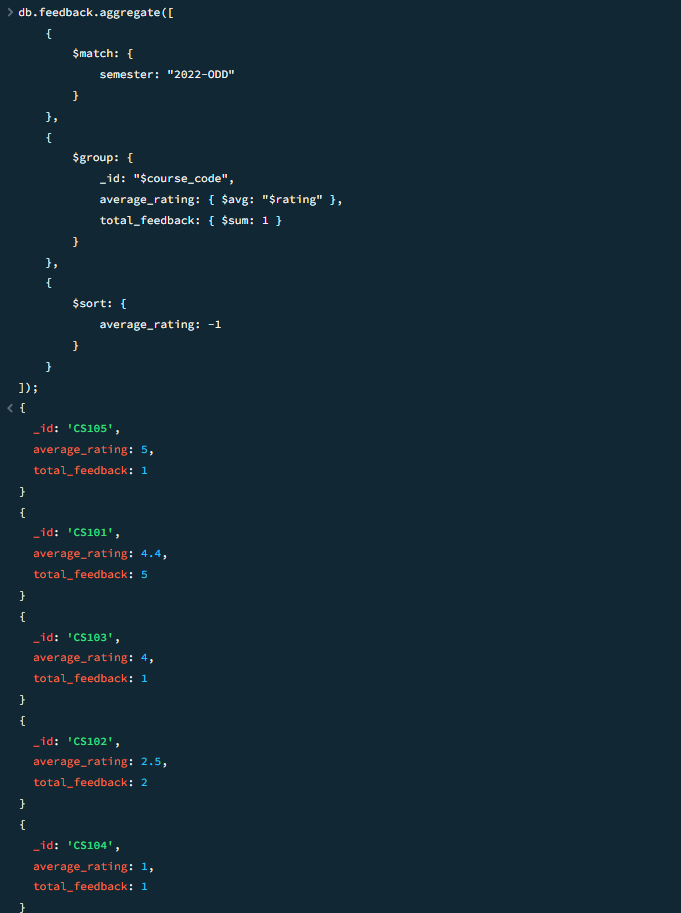
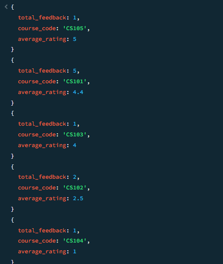
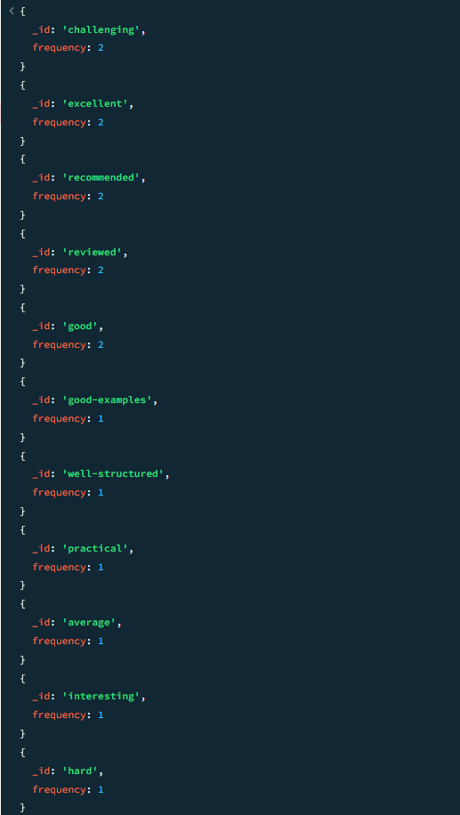
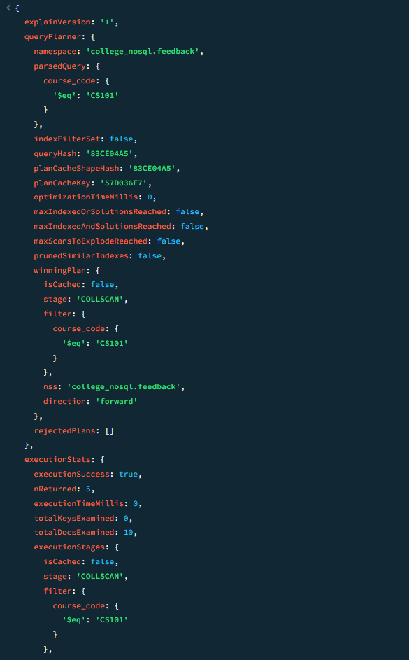

# Hands-On 5 – MongoDB Document Modelling, CRUD Operations & Aggregation Pipeline

## Objective

Create a MongoDB database and collection, perform CRUD operations on documents, and analyze data using MongoDB Aggregation Pipeline.

---

# Task 1 – Create Collection and Insert Documents

## Step 60 – Create and Use the Database

```javascript
use college_nosql
```
---

## Step 61 – Create the Feedback Collection

```javascript
db.createCollection("feedback");
```
---

## Step 62 – Insert Sample Feedback Documents
Sample documents imported from feedback.json
```javascript
db.feedback.insertMany([
    ...
]);
```
---

## Step 63 – Insert a Feedback Document Without Attachments

```javascript
db.feedback.insertOne({
    student_id: 11,
    course_code: "CS101",
    semester: "2022-ODD",
    rating: 4,
    comments: "Helpful course with clear explanations.",
    tags: ["good"]
});
```

---

## Step 64 – Verify the Number of Documents

```javascript
db.feedback.countDocuments();
```

### Output



---

# Task 2 – CRUD Operations

## Step 65 – Retrieve All Feedback with Rating 5

```javascript
db.feedback.find({
    rating: 5
});
```

### Output

--

## Step 66 – Find CS101 Feedback Tagged as "challenging"

```javascript
db.feedback.find({
    course_code: "CS101",
    tags: "challenging"
});
```

### Output


---

## Step 67 – Display Student ID, Course Code and Rating Only

```javascript
db.feedback.find(
    {},
    {
        student_id: 1,
        course_code: 1,
        rating: 1,
        _id: 0
    }
);
```

### Output


---

## Step 68 – Mark Feedback with Rating Less Than 3 for Review

```javascript
db.feedback.updateMany(
    {
        rating: { $lt: 3 }
    },
    {
        $set: {
            needs_review: true
        }
    }
);
```

---

## Step 69 – Add "reviewed" Tag to Reviewed Documents

```javascript
db.feedback.updateMany(
    {
        needs_review: true
    },
    {
        $push: {
            tags: "reviewed"
        }
    }
);
```

---

## Step 70 – Delete Feedback Submitted in Semester "2021-EVEN"

```javascript
db.feedback.deleteMany(
    {
        semester: "2021-EVEN"
    }
);
```

---

# Task 3 – Aggregation Pipeline

## Step 71 – Calculate Average Rating and Total Feedback for Each Course

```javascript
db.feedback.aggregate([
    {
        $match: {
            semester: "2022-ODD"
        }
    },
    {
        $group: {
            _id: "$course_code",
            average_rating: { $avg: "$rating" },
            total_feedback: { $sum: 1 }
        }
    },
    {
        $sort: {
            average_rating: -1
        }
    }
]);
```

### Output


---

## Step 72 – Round Average Rating to One Decimal Place

```javascript
db.feedback.aggregate([
    {
        $match: {
            semester: "2022-ODD"
        }
    },
    {
        $group: {
            _id: "$course_code",
            average_rating: { $avg: "$rating" },
            total_feedback: { $sum: 1 }
        }
    },
    {
        $project: {
            _id: 0,
            course_code: "$_id",
            average_rating: {
                $round: ["$average_rating", 1]
            },
            total_feedback: 1
        }
    },
    {
        $sort: {
            average_rating: -1
        }
    }
]);
```

### Output


---

## Step 73 – Count the Frequency of Each Tag

```javascript
db.feedback.aggregate([
    {
        $unwind: "$tags"
    },
    {
        $group: {
            _id: "$tags",
            frequency: {
                $sum: 1
            }
        }
    },
    {
        $sort: {
            frequency: -1
        }
    }
]);
```

### Output


---

## Step 74 – Verify Index Usage Using Explain

```javascript
db.feedback.find(
    {
        course_code: "CS101"
    }
).explain("executionStats");
```

### Output


---

# Learning Outcomes

After completing this hands-on, I was able to:

- Create and use a MongoDB database.
- Design document structures with embedded arrays and objects.
- Perform CRUD operations using MongoDB.
- Update and delete documents using conditions.
- Build aggregation pipelines using `$match`, `$group`, `$project`, `$sort`, and `$unwind`.
- Analyze query execution using `explain()`.
- Understand MongoDB document modelling and aggregation techniques.

---

# Author

**Name:** Ezhil Sree J

**Program:** Cognizant Digital Nurture 5.0 – Python Full Stack Engineer (FSE)