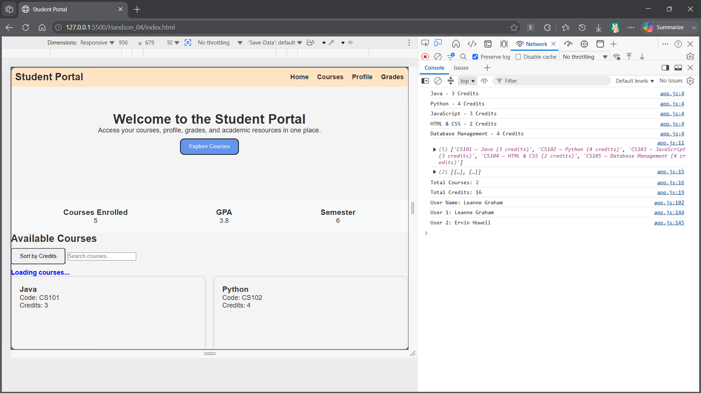
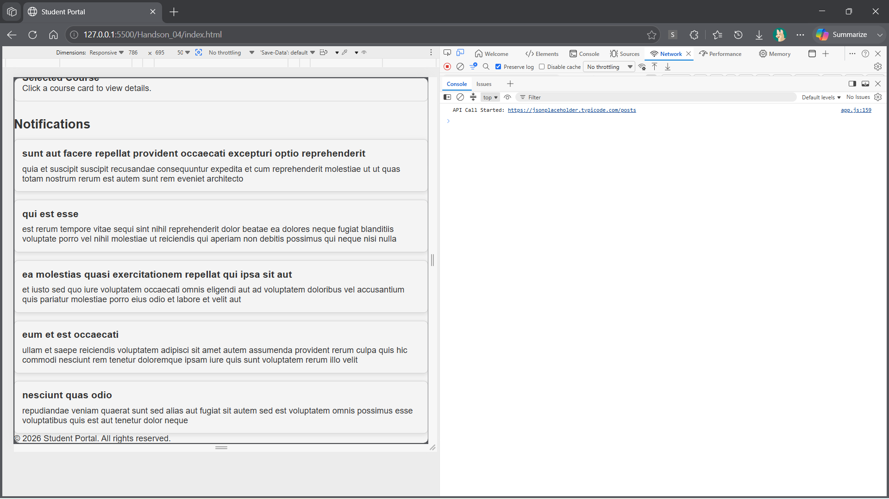
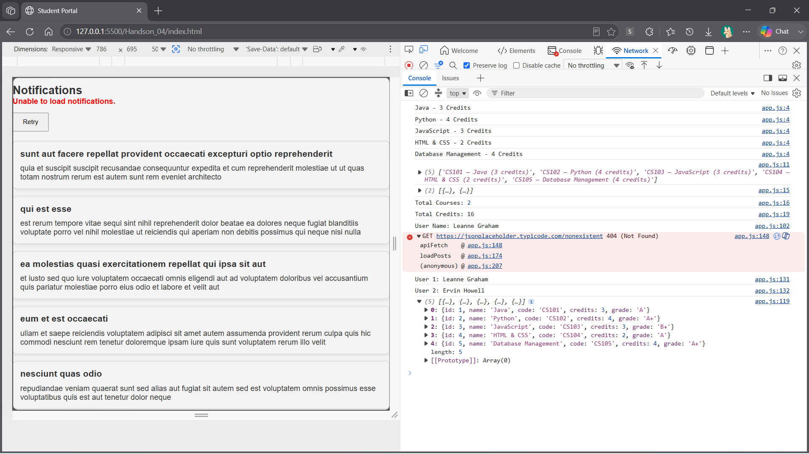
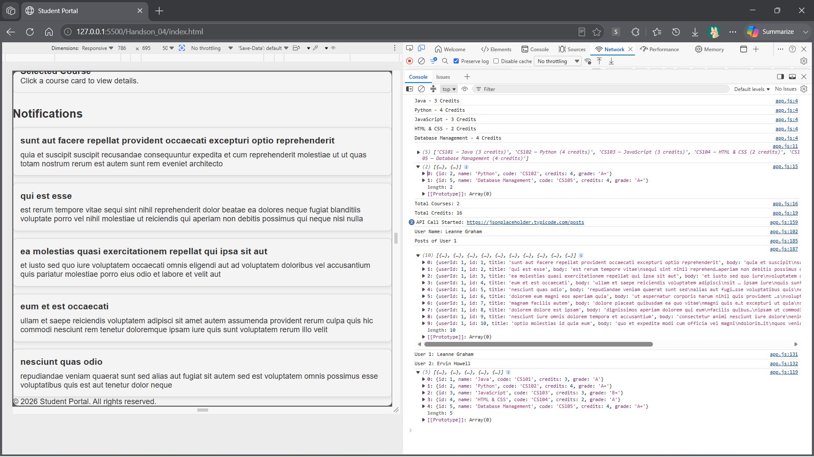

# Handson 04 - Output

## Task 1 - Promises & Async/Await

### Description
- Implemented asynchronous programming using Promises and `async/await`.
- Fetched user details from the JSONPlaceholder API.
- Simulated delayed course loading using a Promise.
- Displayed a loading message before rendering course data.
- Used `Promise.all()` to fetch multiple users simultaneously.

### Output

---

## Task 2 - Fetch API with Error Handling

### Description
- Created a reusable `apiFetch()` function using the Fetch API.
- Loaded notifications dynamically from the JSONPlaceholder Posts API.
- Added a loading indicator while fetching data.
- Implemented proper error handling using `try...catch`.
- Displayed a user-friendly error message for invalid API requests.
- Added a Retry button to reload notifications after an error.

### Output

#### Successful API Response

#### Error Handling & Retry

---

## Task 3 - Introduction to Axios

### Description
- Added Axios using the CDN.
- Replaced Fetch API calls with `axios.get()`.
- Retrieved posts for User ID 1 using query parameters.
- Configured an Axios request interceptor to log every API request.
- Compared Fetch API and Axios through code comments.

### Output

---

## Result

Successfully completed **Handson 04 – Async JavaScript, Fetch API & API Integration**, including:
- Promises & Async/Await
- Fetch API with Error Handling
- Axios API Integration
- Loading States
- Request Interceptors
- Dynamic DOM Updates